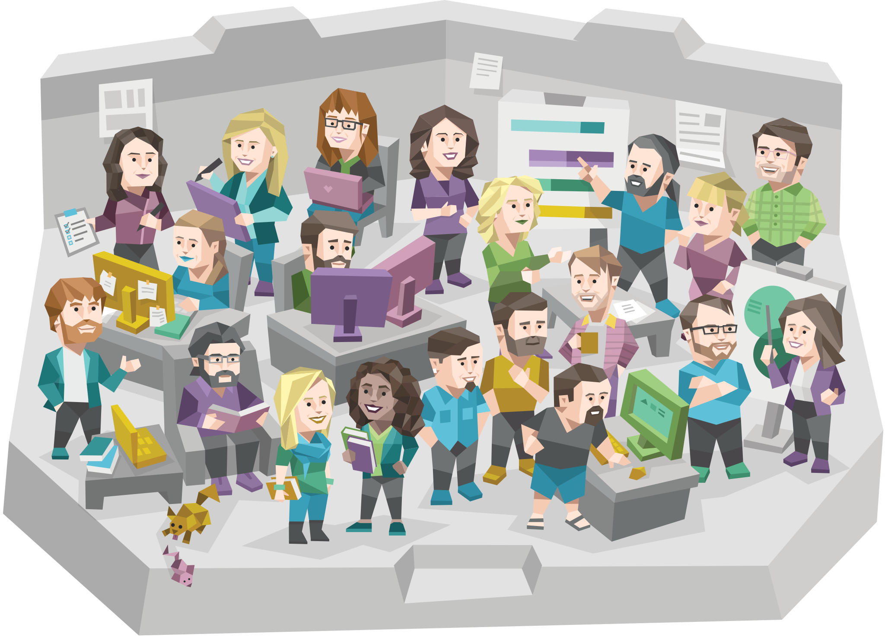
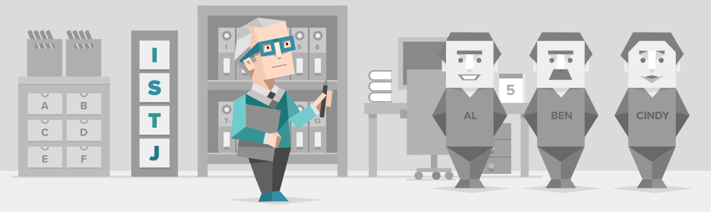
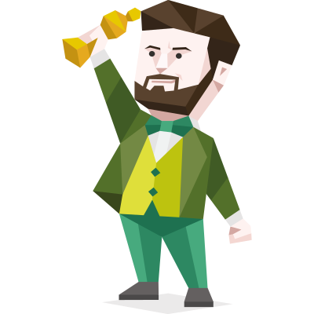
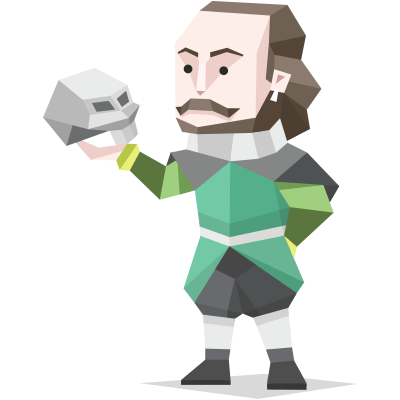
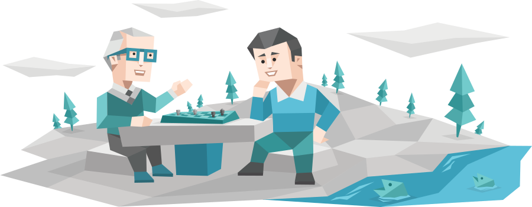

:title: El mundo interno del Programador
:data-transition-duration: 1000
:css: css/styles.css
:skip-help: true

----

El Mundo Interno del Programador
================================

----

:data-rotate-z: 90
:data-z: 2000
:data-y: r3000

Perfil psicológico
==================

* Capretz (2003): La mayoría tenemos personalidad tipo **ISTJ**.
    - **I**: Introverted (not Extroverted)
    - **S**: Sensitive (not Intuitive)
    - **T**: Thinking (not Emotional)
    - **J**: Judging (not Perceptive)

----

¿Qué significa esto?
====================

Fortalezas
----------

* Somos analíticos.
* Podemos concentrarnos fácilmente.

Debilidades
-----------

* Manejamos mal las relaciones.
* Tenemos problemas para comunicarnos.

----

:data-rotate-z: 0
:data-z: -2000
:data-y: r5000

Actitudes tóxicas en el trabajo/estudios
========================================

* "No se viene a hacer amigos".
* Complejo de superioridad encubierto.
* Rutinas autodestructivas (alimentación, sueño, ejercicio).

----

:data-rotate-x: 45
:data-y: r3000

El momento de quiebre
=====================

* Falta de motivación.
* Falta de energía.
* Falta de interés.
* Colapso.

----

:data-rotate-x: 0
:data-rotate-z: 90

Problema 1: Sobrecompensación de carencias emocionales
======================================================

* Mecanismo de adaptación.
* Necesidades emocionales:
	- Ser comprendido.
	- Ser admirado.
	- Ser tomado en cuenta.
	- etc.

----

Problema 2: Disociación de la realidad
======================================

.. image:: images/infp-mediator.svg
   :class: right
   :width: 400px

* Mecanismo de adaptación.
* Problemas:
    - En las relaciones.
    - En la situación económica.
    - De salud.

----

Problema 3: Soledad/Autosuficiencia
===================================

* Mecanismo de adaptación.
* Producto de decepciones.
* Sin red de soporte.

----

:data-rotate-x: 45
:data-rotate-z: 0

.. image:: images/trusted_profiles.svg
   :class: center
   :width: 500px

Buscando soluciones
===================

----

.. class:: center

Amigos sanos

----

.. class:: center

Parejas sanas

----

.. class:: center

Enfrentemos los problemas

.. class:: center

Busquemos soluciones

----

* Ir al psicólogo.
* Leer acerca de Psicoeducación.
* Aceptar nuestras emociones.
* Asistir a actividades recreativas.

----

Gracias por escuchar
====================

Luis Alejandro Martínez Faneyth

@LuisAlejandro